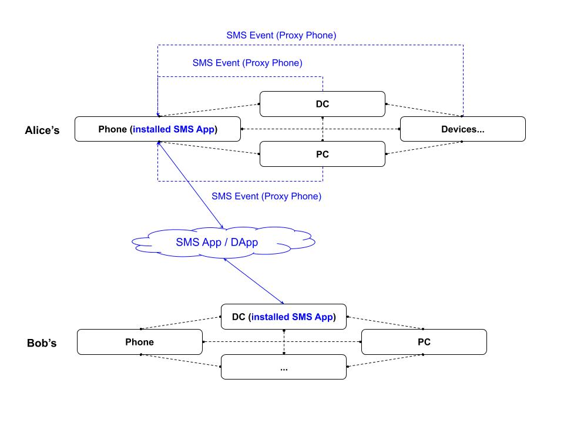

# Assassin
Personal distributed data assistant build on TDN. And How to use.

1. Assassin, a permissioned DApp. (DOING)
2. Example for SMS(chat) DEMO, a permissionless DApp. (TODO)

## Experience in browser.
- run `cargo run`, and it will start use `config.toml`.
- open `127.0.0.1:8000` in brower. html in assets/index.html

## How ?



## rpc with server
```
{
    "jsonrpc": "2.0",
    "id": 0,
    "app": "system"
    "method": "start",
    "params": ["s", 1]
}
```


## License

This project is licensed under either of

 * Apache License, Version 2.0, ([LICENSE-APACHE](LICENSE-APACHE) or
   http://www.apache.org/licenses/LICENSE-2.0)
 * MIT license ([LICENSE-MIT](LICENSE-MIT) or
   http://opensource.org/licenses/MIT)

at your option.

